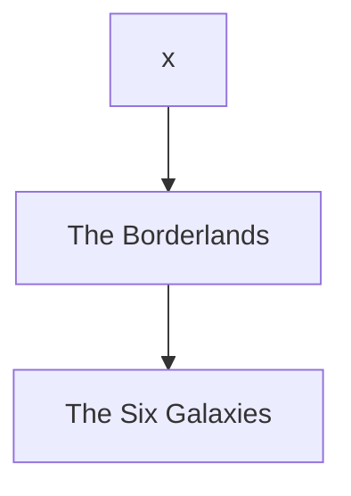

image | introduced in (content)
-- | --
Type | X

> quote

\- someone

# Overview

# Regions

# Inhabitants

# Involvement

# Trivia

# Hierarchy

```mermaid
flowchart TD

B[The Borderlands] --> A[The Six Galaxies];
C[x] --> B
```

# Sources